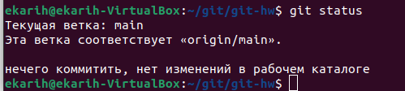
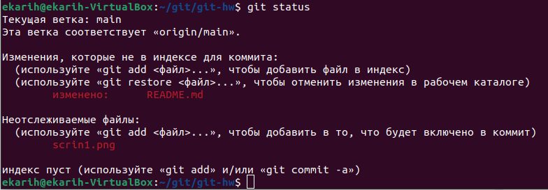
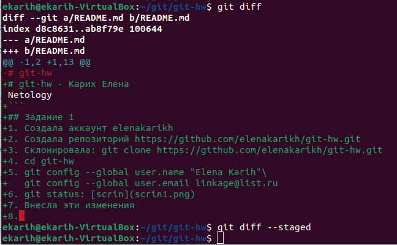
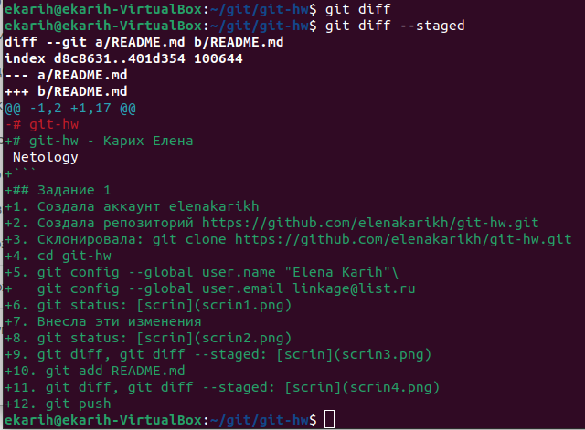

# git-hw - Карих Елена
Netology
```
## Задание 1
1. Создала аккаунт elenakarikh
2. Создала репозиторий https://github.com/elenakarikh/git-hw.git
3. Склонировала: git clone https://github.com/elenakarikh/git-hw.git
4. cd git-hw
5. git config --global user.name "Elena Karih"\
   git config --global user.email linkage@list.ru
6. git status: 
7. Внесла эти изменения
8. git status: 
9. git diff, git diff --staged: 
10. git add README.md
11. git diff, git diff --staged: 
12. git push
